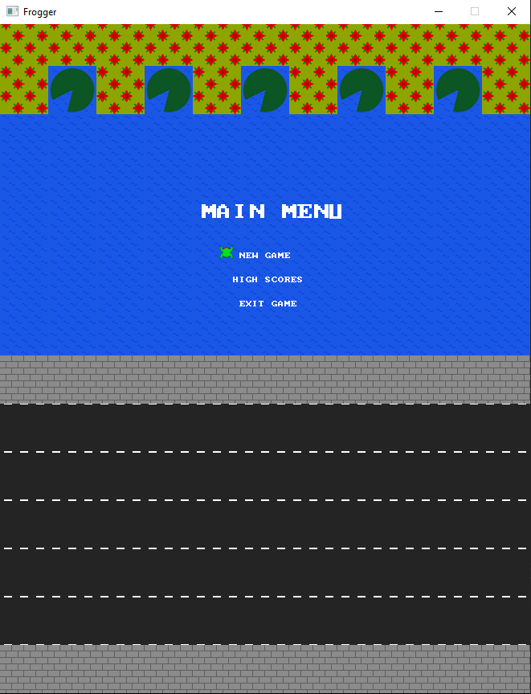

# Frogger
## Sections

 - [Visuals](#visuals)
 - [Description](#description)
	 - [General](#general)
	 - [Main features](#main-features)
	 - [Programming languages and libraries](#programming-languages-and-libraries)
 - [Usage](#usage)

## Visuals

### Menu

### Gameplay

## Description

### General
Game Frogger, university project

### Main features
  - Frogger mechanics
    - Cars
    - Turtles and diving turtles
    - Floating logs
    - Three lives
    - Time limit
  - High scores
  - Pausing game
  - Animations

### Programming languages and libraries
 - C++ (OOP)
 - SDL2

## Usage
 - University project
 - Playing game
